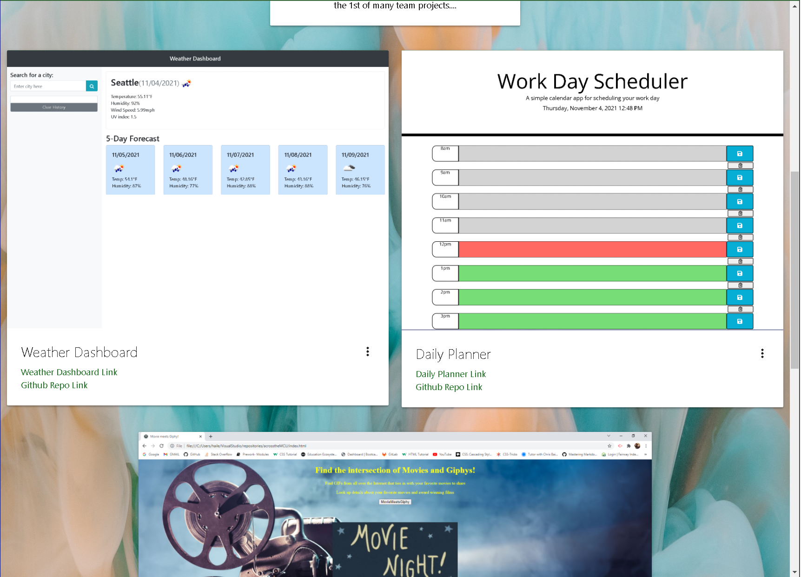

# new-portfolio-project
File for my week 8 homework assignment
## Languages Used
HTML, CSS, Materialize
## Summary
I remade my professional portfolio page from scratch using some of the <br> 
new skills I have acquired since I made the previous poertfolio page.
## Preview of the site


## Code Snippet
```
<div class="row" id="Projects">
        <div class="col s6">
            <div class="card">
                <div class="card-image waves-effect waves-block waves-light">
                    
                </div>
                <div class="card-content">
                    <span class="card-title activator grey-text text-darken-4">Weather Dashboard<i
                            class="material-icons right">more_vert</i></span>
                    <p><a href="https://oscarp76.github.io/op-week6-homework/" class="green-text text-darken-3">Weather
                            Dashboard Link</a></p>
                            <p><a href="https://github.com/OscarP76/op-week6-homework" class="green-text text-darken-3">Github Repo Link</a></p>       
                </div>
                <div class="card-reveal">
                    <span class="card-title grey-text text-darken-4">Weather Dashboard<i
                            class="material-icons right">close</i></span>
                    <p>This weather dashboard was created using HTML, CSS, Bootstrap, JavaScript, & JQuery. <br>
                        I created a 5 day forecast using an API key from openweathermap.org.<br>
                        The weather forecast uses logic to include the weather patterns for the present and for the next 5 days.
                        The text area input saves to local storage. </p>
                </div>
            </div>
        </div>

```
## My Links
[New Portfolio](https://oscarp76.github.io/new-portfolio-project/)
[GitHub](https://github.com/OscarP76)
